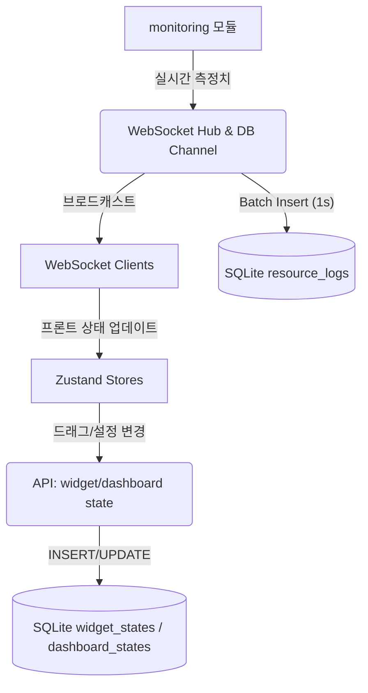

이 기획서는 **데이터 퍼시스턴스 및 위젯 확장** 요구사항을 충족하기 위한 상세 기획서입니다.
완료된 이슈는 ✅, 아직인 경우 ❌ 아이콘을 사용 합니다.
[❌] 위젯 & 대시보드 상태 영속화
[❌] 실시간 하드웨어 모니터링 로그 저장
[❌] 확장 가능한 하드웨어 모니터링 위젯 구조 설계

[연관 기획서]
  - [:Parent:] 프로젝트_메인기획.md
  - [:Rel:] 백엔드_아키텍처.md
  - [:Rel:] 프론트엔드_아키텍처.md

[연관 폴더와 파일]
  - backend/db/
  - backend/api/
  - backend/monitoring/
  - frontend/src/stores/
  - frontend/src/services/

[핵심 주제]
  - [❌] SQLite 스키마 확장: `widget_states`, `dashboard_states`, `resource_logs`, **`resource_meta`** 추가
  - [❌] 백엔드 API 확장: 상태 CRUD, 로그 조회 API
  - [❌] 모니터링 데이터 ETL: 실시간 수집 → DB 저장
  - [❌] 프론트엔드 초기 로딩: 상태 복원 로직
  - [❌] 위젯 메타데이터 테이블 및 동적 위젯 로딩
  - [❌] **신규 하드웨어 위젯(GPU·Disk·Network) 설계 및 등록**

[Tasks]
  ### 1. 데이터베이스 스키마 설계
  - [❌] `widget_states` 테이블 (id, user_id, widget_id, config_json, pos_x, pos_y, width, height, updated_at)
  - [❌] `dashboard_states` 테이블 (id, user_id, layout_json, updated_at)
  - [❌] `resource_logs` 테이블 (id, timestamp, metric_type, value)
  - [❌] `widget_meta` 테이블 (widget_id, name, description, metric_type)
  - [❌] **`resource_meta` 테이블 (metric_type, unit, description)**

  ### 2. 백엔드 로직 구현
  - [❌] 상태 저장/업데이트 API (`/api/widget-state`, `/api/dashboard-state`)
  - [❌] 로그 삽입 로직: `monitoring` 모듈 → 채널 → DB Insert (Batch 1s)
  - [❌] 로그 조회 API (`/api/resource-logs?type=cpu&from=...&to=...`)
  - [❌] **GPU·Disk·Network 모니터링 수집 함수 추가 (gopsutil)**

  ### 3. 프론트엔드 로직 구현
  - [❌] 앱 초기화 시 `dashboard_states`, `widget_states` Fetch & Store 반영
  - [❌] 드래그/리사이즈/설정 변경 시 자동 저장 (Debounce 500ms)
  - [❌] 새로운 위젯 타입 등록 시 `widget_meta` 조회하여 동적 Import
  - [❌] 로그 뷰어 위젯용 데이터 Fetch 기능 추가
  - [❌] **GPUWidget, DiskWidget, NetworkWidget 컴포넌트 구현**

  ### 4. 위젯 확장 가이드
  - [❌] 공통 위젯 인터페이스 정의 (props: `data`, `config`, `onConfigChange`)
  - [❌] `metric_type` 기반 데이터 매핑 규칙 수립 (cpu, ram, gpu, disk, net)
  - [❌] 차트/그래프 컴포넌트 재사용성 강화 (HOC or Hooks)

  ### 5. 테스트 & 검증
  - [❌] 단위 테스트: DB CRUD, API 응답, 상태 복원
  - [❌] 통합 테스트: 모니터링 → DB → API → 프론트엔드 파이프라인
  - [❌] 부하 테스트: 로그 삽입 TPS, 조회 응답시간

---

## 1. 요구사항 분석

1. **상태 영속화**: 위젯 및 대시보드 상태를 SQLite 에 저장하여 브라우저 새로고침 후에도 동일한 레이아웃과 설정을 복원해야 한다.
2. **모니터링 로그 저장**: 모든 순간의 하드웨어 자원 정보를 `resource_logs` 에 기록하여, 이후 로그 기반 위젯(예: 히스토리 차트)을 구현할 수 있어야 한다.
3. **위젯 확장성**: CPU, RAM 외 GPU, Disk, Network 등 추가 하드웨어 모니터링 위젯을 손쉽게 등록할 수 있는 메타데이터 기반 구조가 필요하다.

## 2. DB 스키마 (초안)

```sql
-- 위젯 상태 저장
CREATE TABLE IF NOT EXISTS widget_states (
  id INTEGER PRIMARY KEY AUTOINCREMENT,
  user_id TEXT,
  widget_id TEXT,
  config_json TEXT,
  pos_x INTEGER,
  pos_y INTEGER,
  width INTEGER,
  height INTEGER,
  updated_at DATETIME DEFAULT CURRENT_TIMESTAMP
);

-- 대시보드 전체 레이아웃
CREATE TABLE IF NOT EXISTS dashboard_states (
  id INTEGER PRIMARY KEY AUTOINCREMENT,
  user_id TEXT,
  layout_json TEXT,
  updated_at DATETIME DEFAULT CURRENT_TIMESTAMP
);

-- 자원 모니터링 로그
CREATE TABLE IF NOT EXISTS resource_logs (
  id INTEGER PRIMARY KEY AUTOINCREMENT,
  timestamp DATETIME NOT NULL,
  metric_type TEXT,  -- cpu, ram, gpu, disk, net
  value REAL
);

-- 위젯 메타데이터 (확장용)
CREATE TABLE IF NOT EXISTS widget_meta (
  widget_id TEXT PRIMARY KEY,
  name TEXT,
  description TEXT,
  metric_type TEXT
);

-- (추가) 모니터링 지표 메타데이터
CREATE TABLE IF NOT EXISTS resource_meta (
  metric_type TEXT PRIMARY KEY, -- cpu, ram, gpu, disk, net
  unit TEXT,
  description TEXT
);
```

## 3. 모듈 간 데이터 흐름



## 4. API 명세 (초안)

| Method | Endpoint | Body/Query | 응답 |
| ------ | -------- | ---------- | ---- |
| GET | `/api/widget-state` | `?user_id=123` | `[ { widget_id, config_json, pos_x, ... } ]` |
| POST | `/api/widget-state` | `{ widget_id, config_json, pos_x, ... }` | `{ success:true }` |
| GET | `/api/dashboard-state` | `?user_id=123` | `{ layout_json }` |
| POST | `/api/dashboard-state` | `{ layout_json }` | `{ success:true }` |
| GET | `/api/resource-logs` | `?type=cpu&from=...&to=...` | `[ { timestamp, value } ]` |
| GET | `/api/metrics` |  | `[ { metric_type, unit, description } ]` |

## 5. 백엔드 구현 포인트

1. **Batch Insert 최적화**: `monitoring` 모듈에서 수집 주기와 별개로 1초 단위 배치 DB insert로 I/O 부하 감소
2. **Prepared Statement 재사용**: 빈번한 Insert 성능 최적화
3. **인덱스 설계**: `resource_logs(metric_type, timestamp)` 복합 인덱스
4. **데이터 보존 정책**: 일정 기간 지난 로그는 아카이빙 or 파티셔닝 검토

## 6. 프론트엔드 구현 포인트

1. **초기 로딩 시 상태 복원**: `useEffect` App 진입점에서 API 호출 후 `dashboardStore`, `widgetStore` 초기화
2. **자동 저장**: `lodash.debounce` 이용, UI 변경 시 500ms 대기 후 상태 POST
3. **위젯 팩토리 패턴**: `widget_meta`를 기반으로 컴포넌트 맵핑하여 동적 Import (`React.lazy`)
4. **로그 뷰어 위젯**: 차트 라이브러리(Recharts)로 기간별 데이터 시각화

## 7. 테스트 계획

- **Unit**: DB Handler, API Handler, Store Reducer
- **Integration**: End-to-End(Backend ↔ Frontend) Cypress 테스트
- **Load**: 1,000 msg/s 모니터링 데이터 삽입 시 TPS 측정

## 8. 일정 (Tentative)

| Week | Tasks |
| ---- | ----- |
| 1주차 | DB 스키마 확정, API 설계, 모니터링 Batch Insert 구현 |
| 2주차 | 상태 CRUD API 및 프론트 복원 로직 구현 |
| 3주차 | 로그 뷰어 위젯 및 추가 위젯 메타데이터 구조 구현 |
| 4주차 | 테스트, 문서화, 성능 튜닝 | 