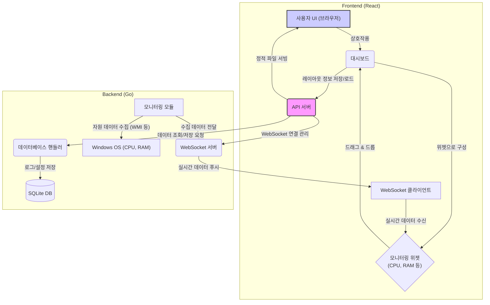

# 프로젝트_메인기획

이 기획서는 **실시간 컴퓨팅 자원 모니터링 웹앱** 개발에 대한 메인 기획서입니다.

[❌] 프로젝트 구조 및 아키텍처 설계
[❌] 백엔드 시스템 설계
[❌] 프론트엔드 시스템 설계
[❌] 데이터베이스 스키마 설계
[❌] API 명세서 작성

---

## 1. 프로젝트 개요

- **목표**: Windows 환경의 CPU, RAM 등 컴퓨팅 자원을 실시간으로 모니터링하고, 사용자가 커스터마이징할 수 있는 대시보드 형태의 웹 애플리케이션을 개발합니다.
- **핵심 기능**:
    - 실시간 자원 사용량 시각화 (그래프, 게이지 등)
    - 드래그앤드롭으로 위젯을 배치할 수 있는 커스텀 대시보드
    - 위젯별로 실시간 데이터 또는 로그 조회 기능
    - 모듈화된 구조로 기능 확장성 확보

## 2. 개발 환경 및 기술 스택

- **OS**: Windows
- **Backend**: Go
- **Frontend**: React
- **Database**: SQLite
- **실시간 통신**: WebSockets

## 3. 전체 시스템 아키텍처

아래는 제안하는 시스템의 전체 구조입니다. 백엔드는 Go를 사용하여 Windows 시스템 자원을 수집하고 WebSocket을 통해 프론트엔드에 실시간으로 전달합니다. 프론트엔드는 React로 구현되며, 사용자는 위젯 기반의 대시보드를 자유롭게 구성할 수 있습니다.



## 4. 제안하는 디렉토리 구조

```
/
├── 기획/
│   ├── 프로젝트_메인기획.md
│   └── (추가 기획 문서)
├── backend/
│   ├── main.go
│   ├── api/
│   ├── db/
│   ├── monitoring/
│   ├── websockets/
│   └── go.mod
├── frontend/
│   ├── src/
│   │   ├── components/
│   │   │   ├── Dashboard/
│   │   │   └── Widget/
│   │   │   
│   │   └── ...
│   ├── package.json
│   └── ...
├── database/
│   └── monitoring.db
└── docker-compose.yml
```

## 5. 연관 기획서

- `[:Child:]` 백엔드_아키텍처.md (예정)
- `[:Child:]` 프론트엔드_아키텍처.md (예정)
- `[:Child:]` API_명세서.md (예정) 